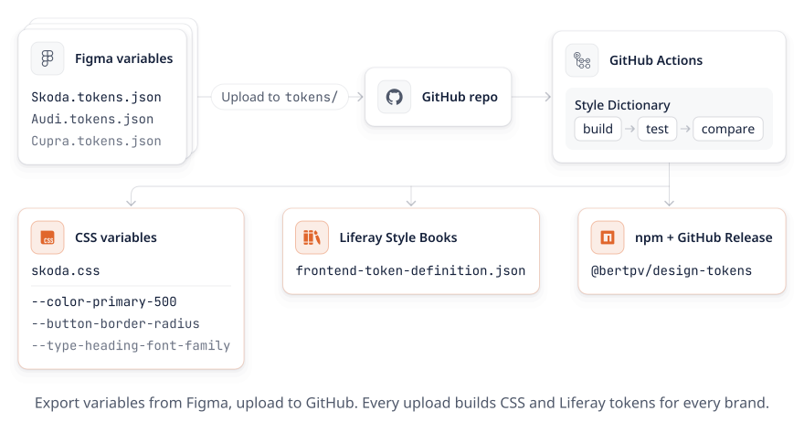

# Design tokens (multi-brand)

Figma variables → GitHub → [Style Dictionary](https://styledictionary.com) → CSS variables + Liferay Style Book tokens.

<picture>
  <source media="(prefers-color-scheme: dark)" srcset="docs/pipeline-dark.svg">
  
</picture>

## For designers: update the tokens

Every brand is one file in `tokens/`. The file name decides the brand name:
`Skoda.tokens.json` becomes `skoda.css`, and `VW Commercial.tokens.json` becomes `vw-commercial.css`.

1. In Figma, export the variables collection. Each mode (brand) is saved as `<Brand>.tokens.json`.
2. On GitHub, open the **`tokens/`** folder and choose **Add file → Upload files**.
3. Drop in one or more exported files:
   - **Update a brand:** use the same file name, which overwrites the old file.
   - **Add a brand:** use a new file name. No other change is needed.
   - **Remove a brand:** delete its file from `tokens/`.
4. Write a short message (for example "Update secondary green") and click **Commit changes**.
5. Open the **Actions** tab and wait for the green check (about 1 minute).
   - The run summary lists every token that differs from the production baseline.
   - A red cross means something is wrong in the tokens, such as a broken alias. Click the run to see the error; nothing was published.

## For developers: use the tokens

### Option A: direct download (no npm)

Each build creates a [GitHub Release](../../releases) that contains:

| File | Use |
|---|---|
| `<brand>.css` | Drop-in replacement for the hand-written `:root { --… }` token file |
| `<brand>.frontend-token-definition.json` | Liferay Style Books (see below) |

This link always points to the newest build (public repos only):
`https://github.com/<owner>/<repo>/releases/latest/download/<brand>.css`

### Option B: npm (GitHub Packages)

1. Create a GitHub personal access token (classic) with the `read:packages` scope.
2. Add a `.npmrc` next to your `package.json`:

   ```
   @<owner>:registry=https://npm.pkg.github.com
   //npm.pkg.github.com/:_authToken=${GITHUB_TOKEN}
   ```

3. Install the package and import the CSS:

   ```bash
   npm install @<owner>/design-tokens
   ```

   ```scss
   @import '@<owner>/design-tokens/css/skoda.css';
   ```

   One package contains every brand: `css/<brand>.css` and `liferay/<brand>/frontend-token-definition.json`.
   All brands share the same variable names, so a theme switches brand by importing a different file.

## Liferay

### Now: replace the token CSS
The theme currently defines tokens in its own CSS/SCSS file. Replace that file with the generated `<brand>.css`, either copied from a Release or imported from the npm package in the theme build. The variable names are identical, so no component CSS has to change.

### Next step: Style Books
`frontend-token-definition.json` turns every token into an editable field under **Design → Style Books**, with the Figma values as defaults. Colors use a color picker and pixel values use a length editor.

- **Theme CSS client extension** (DXP 2024.Q2+ / GA120+), in `client-extension.yaml`:
  ```yaml
  skoda-theme-css:          # one client extension per brand
    type: themeCSS
    name: Skoda Theme CSS
    clayURL: css/clay.css
    mainURL: css/main.css
    frontendTokenDefinitionJSON: src/frontend-token-definition.json
  ```
- **Classic theme:** place the file at `src/WEB-INF/frontend-token-definition.json`.

Style Books write the chosen values as CSS variables, so the theme CSS must use `var(--…)` everywhere. It already does.
Docs: [Frontend token definitions](https://learn.liferay.com/w/dxp/sites/site-appearance/style-books/developer-guide/frontend-token-definitions) · [Theme CSS client extension](https://learn.liferay.com/w/dxp/development/customizing-liferays-look-and-feel/using-a-theme-css-client-extension/theme-css-yaml-configuration-reference)

## How the conversion works

| Figma export | CSS output | Where |
|---|---|---|
| Color object `{ hex, alpha }` | `#1A392F`, or `rgba(…)` if alpha < 1 | `config/transforms.mjs` → `figma/color` |
| Alias `{color.primary.500}` | `var(--color-primary-500)` | `outputReferences` in `config/platforms.mjs` |
| Number `24` | `24px` (font-weight etc. stay unitless) | `figma/px`, `UNITLESS` list |
| String `Skoda` | `"Skoda"` | `figma/quote` |
| Group `header nav` | `--headernav-…` | `figma/kebab` |

Every `tokens/*.tokens.json` is built separately: `tokens/Skoda.tokens.json` becomes `dist/css/skoda.css` and `dist/liferay/skoda/…`.
The shared build logic is in `config/build-brand.mjs`.
To add an output format such as SCSS or JS, add a platform in `config/platforms.mjs`.

The build **fails** (and nothing is published) on broken aliases, name collisions or other Style Dictionary warnings.

## Local development

```bash
npm install
npm run build     # generates dist/
npm test          # regression checks
npm run compare   # diff each brand against reference/<brand>.production.css
```

**Tests** check the conversion rules against a fixed file (`test/fixtures/`), so a designer's value changes never break them.
For every real brand, they check that the CSS and Liferay files match.
If `reference/<brand>.production.css` exists, they also check that no production variable has disappeared. When a variable is removed on purpose, remove it from that reference file too.

Versions are set automatically in CI as `1.0.<run number>`.
